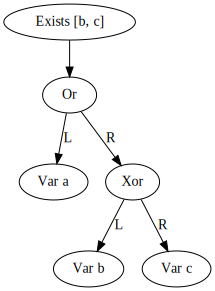

# RsBDD

[](https://github.com/timbeurskens/rsbdd/actions/workflows/rust.yml) 

_Solving satisfiability problems in Rust_

## Syntax

### Comments

Characters contained within "..." (excluding the " char itself) are regarded as comments and can be placed at any point in the formula.

### Constants

The most basic building blocks of the syntax are 'variables' and 'constants'. A constant can be either 'true' or 'false'. A variable can accept either a 'true' or 'false' value after evaluation depending on its environment.

```
true
false
```

### Variables

A variable is a single word starting with a non-digit character. Examples of good variable names are:

```
a
alpha
_x
a1
hello_world
```

### Negation

A variable, constant, or sub-formula can be negated using the negation operator. This operator can be expressed by either `!`, `-`, or `not`.

```
not true
-false
!variable
```

### Binary operators

RsBDD supports the most common, and some uncommon binary operators, such as conjunction, disjunction, implication and bi-implication.

Most operators have a symbolic and textual representation, e.g. `and` or `&`.

| Operator           | Option 1          | Option 2 |
|--------------------|-------------------|----------|
| Conjunction        | `and`             | `&`      |
| Disjunction        | `or`              | `\|`     |
| Implication        | `implies` or `in` | `=>`     |
| Bi-implication     | `iff` or `eq`     | `<=>`    |
| Exlusive or        | `xor`             | `^`      |
| Joint denial       | `nor`             | N.A.     |
| Alternative denial | `nand`            | N.A.     |

```
true or false
true | false
a | b
a & b
a and b
a => b
hello <=> world
on ^ off
```

### Composition

Larger formulae can be composed using left and right parentheses: `(`, `)`:

```
a | (a & b)
(a)
((a))
!(a & b)
(a & b) | (b & c)
```

### If-then-else

A simplification of a common expression `(a => b) & ((!a) => c)` can be made using the ternary if-then-else (ite) operator.

```
if a then b else c
if exists a # a <=> b then b <=> c else false | c
```

### Quantifiers

The RsBDD supports universal and existential quantification using the `exists` and `forall`/`all` keywords: `{forall|exists} var_1, var_2, .., var_n # {subformula}`

```
forall a # true
forall a # a | b
forall a, b # exists c # (c | a) & (c | b)
```

### Counting

For some problems it can be beneficial to express properties relating to the number of true or false variables, e.g. "at least 2 of the 4 properties must hold".

The counting operator (`[]`) in combination with five new equality and inequality operators (`=`, `<=`, `>=`, `<`, `>`) can be used to concisely express these properties.

_Note:_ like most operators, the counting operator can be expressed using logic primitives, but this operator simplifies the expression significantly.

A counting comparison can either be made by comparing a set of expressions to a given constant, or an other set of expressions.

```
"exactly one of a, b, and c holds"
[a, b, c] = 1

"there are strictly less true expressions in a, b, c than d, e, f"
[a, b, c] < [d, e, f]
```

### Fixed points

The rsbdd language supports least-fixpoint (`lfp` / `mu`) and greatest-fixpoint (`gfp` / `nu`) operations to find a respectively minimal or maximal solution by repeatedly applying a given transformer function until the solution is stable.

Only monotonic transformer functions are guaranteed to terminate. Termination of fixed point operations are not checked and will run indefinatedly if not handled correctly.

Its basic properties are defined as follows.

```
gfp X # X           <=> true
lfp X # X           <=> false

gfp/lfp X # a       <=> a
gfp/lfp X # true    <=> true
gfp/lfp X # false   <=> false
```

### Parse-tree display

Adding the `-p {path}` argument to `rsbdd` constructs a graphviz graph of the parse-tree. This can be used to for introspection of the intended formula, or for reporting purposes. An example of the parse-tree output for `exists b,c # a | (b ^ c)` is displayed below.



### Experimental and/or upcoming features

Currently the RsBDD language relies heavily on logical primitives. Integer arithmetic could be expressed by manually introducing the primitive 'bits' of a number. Rewrite rules could significantly simplify this process by introducting domains other than boolean variables. Embedding rewrite rules in the BDD could prove to be a challenge.

## Examples

### Example 1: transitivity of the `>=` operator

```
([a1,a2,a3,a4] >= [b1,b2,b3,b4] & [b1,b2,b3,b4] >= [c1,c2,c3,c4]) => [a1,a2,a3,a4] >= [c1,c2,c3,c4]
```

### Example 2: the 4 queens problem

The famous n-queens problem can be expressed efficiently in the RsBDD language.
The example below shows a 4-queens variant, which can be solved in roughly 15 milliseconds. The library contains a generator for arbitrary n-queens problems.
At this point, the largest verified problem size is n=8, which reports all solutions in less than 20 minutes on modern hardware.
The explosive nature of the problem makes n=9 an infeasable problem. Further optimizations (such as multi-processor parallellism, or vertex ordering) could decrease the run-time in the future.

```
"every row must contain exactly one queen"
[_0x0, _0x1, _0x2, _0x3] = 1 &
[_1x0, _1x1, _1x2, _1x3] = 1 &
[_2x0, _2x1, _2x2, _2x3] = 1 &
[_3x0, _3x1, _3x2, _3x3] = 1 &

"every column must contain exactly one queen"
[_0x0, _1x0, _2x0, _3x0] = 1 &
[_0x1, _1x1, _2x1, _3x1] = 1 &
[_0x2, _1x2, _2x2, _3x2] = 1 &
[_0x3, _1x3, _2x3, _3x3] = 1 & 

"every diagonal must contain at most one queen"
[_0x0] <= 1 &
[_0x1, _1x0] <= 1 &
[_0x2, _1x1, _2x0] <= 1 &
[_0x3, _1x2, _2x1, _3x0] <= 1 &
[_1x3, _2x2, _3x1] <= 1 &
[_2x3, _3x2] <= 1 &
[_3x3] <= 1 &

"the other diagonal"
[_0x3] <= 1 &
[_0x2, _1x3] <= 1 &
[_0x1, _1x2, _2x3] <= 1 &
[_0x0, _1x1, _2x2, _3x3] <= 1 &
[_1x0, _2x1, _3x2] <= 1 &
[_2x0, _3x1] <= 1 &
[_3x0] <= 1
```

Running this example with the following arguments yields a truth-table showing the queen configuration(s) on a 4x4 chess board.

```bash
rsbdd -i examples/4_queens.txt -t -ft
```

| _0x0  | _0x1  | _0x2  | _0x3  | _1x0  | _1x1  | _1x2  | _1x3  | _2x0  | _2x1  | _2x2  | _2x3  | _3x0  | _3x1  | _3x2  | _3x3  | *     |
|-------|-------|-------|-------|-------|-------|-------|-------|-------|-------|-------|-------|-------|-------|-------|-------|-------|
| False | False | True  | False | True  | False | False | False | False | False | False | True  | False | True  | False | False | True  |
| False | True  | False | False | False | False | False | True  | True  | False | False | False | False | False | True  | False | True  |


## CLI Usage

### rsbdd

```
Solver 0.9.0
Tim Beurskens
A BDD-based SAT solver

USAGE:
    rsbdd [FLAGS] [OPTIONS]

FLAGS:
    -r, --ordering      Print the variable ordering to stdout
    -h, --help          Prints help information
    -m, --model         use a model of the bdd as output (instead of the satisfying assignment)
    -g, --plot          show a distribution plot of the runtime
    -t, --truthtable    print the truth-table to stdout
    -v, --vars          print all true variables leading to a truth evaluation
    -V, --version       Prints version information

OPTIONS:
    -b, --benchmark <benchmark>         Repeat the solving process n times for more accurate performance reports
    -e, --eval <evaluate>               Inline evaluate the given formula
    -f, --filter <filter>               only show true or false entries in the truth-table
    -i, --input <input>                 logic input file
    -o, --order <ordering>              Provide a custom variable ordering
    -d, --dot <show_dot>                write the bdd to a dot graphviz file
    -p, --parsetree <show_parsetree>    write the parse tree in dot format to this file

```

### max_clique_gen

```
CliqueGenerator 0.6.2
Tim Beurskens
Converts a graph into a max-clique specification

USAGE:
    max_clique_gen [FLAGS] [OPTIONS]

FLAGS:
    -a, --all           Construct a BDD satisfying all cliques, not just the maximum clique(s)
    -h, --help          Prints help information
    -u, --undirected    Use undirected edges (test for both directions in the set complement operation)
    -V, --version       Prints version information

OPTIONS:
    -i, --input <input>      Input file (graph in csv edge-list format)
    -o, --output <output>    The output file

```

### random_graph_gen

```
RandomGraphGenerator 0.6.2
Tim Beurskens
Generates a random edge list formatted graph

USAGE:
    random_graph_gen [FLAGS] [OPTIONS]

FLAGS:
    -d, --dot           Output in dot format
    -h, --help          Prints help information
    -u, --undirected    Use undirected edges (test for both directions in the set complement operation)
    -V, --version       Prints version information

OPTIONS:
    -c, --colors <colors>        Convert the graph to a graph-coloring specification
    -i, --input <convert>        Do not generate a new graph, but convert an existing edge list
    -e, --edges <edges>          Number of edges
    -o, --output <output>        The output file
    -v, --vertices <vertices>    Number of vertices

```

### n_queens_gen

```
QueenGenerator 0.9.0
Tim Beurskens
Generates n-queen formulae for the SAT solver

USAGE:
    n_queens_gen [OPTIONS]

FLAGS:
    -h, --help       Prints help information
    -V, --version    Prints version information

OPTIONS:
    -o, --output <output>    The output file
    -n, --queens <queens>    The number of queens

```

### sudoku_gen

```
SudokuGenerator 0.9.0
Tim Beurskens
Converts sudoku problems into RsBDD formulas

USAGE:
    sudoku_gen [OPTIONS]

FLAGS:
    -h, --help       Prints help information
    -V, --version    Prints version information

OPTIONS:
    -i, --input <input>      The input sudoku file
    -o, --output <output>    The output rsbdd file

```